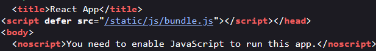

**Category:** Web 
**Points: N/A**
**Description:**  
> Avant de passer aux choses sérieuses, voici un test d'aptitude pour tester tes qualités intellectuelles !     Ce jeux d'échecs est un peu particulier, à toi de trouver la statégie gagnate ! 

## 🧩 Reconnaissance

Visiting the challenge page, we are presented with a chess game interface. At first glance, it seems we may need to defeat an AI to obtain the flag.
But before engaging in a match, we take a smarter route: inspect the source code for hidden clues.

---

Using browser developer tools, we explore the page source and quickly notice a loaded JavaScript file ````bundle.js````



Inside bundle.js, we directly find the flag hardcoded in the script:

````404CTF{l3_nOuveAU_c4RlseN}````

No need to play chess, indeed the strategy was simply to analyze the code!