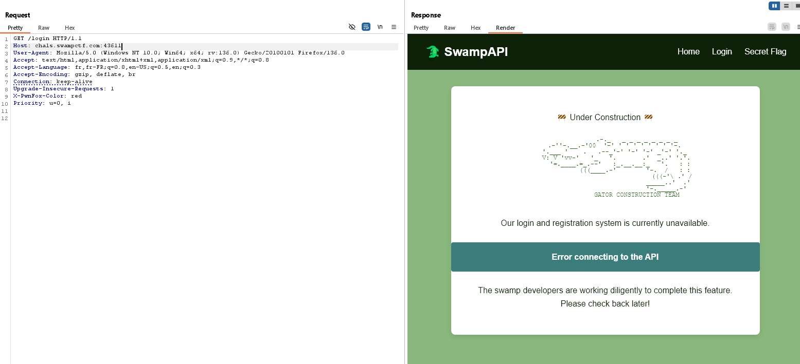

# 🧀 SlowAPI - Writeup

**Challenge Name:** SlowAPI  
**Points:** 50  
**Category:** Web  
**Description:**  
> The Gator Research Institute asked me to develop an app for them. I've been hearing a lot of hullabaloo recently about Next.js, so I decided to make my app inspired by their code. Can you see if you can access the flag? Authentication hasn't been implemented yet, so you'll need to find a way around it.

---

## 🧠 TL;DR

We exploit **CVE-2025-29927**, a vulnerability in **Next.js** middleware that allows bypassing authentication by appending `/%2e/` (encoded `/.`) to a protected API route. This lets us access `/api/protected/flag` and retrieve the flag without proper authentication.

---

## 🕵️ Reconnaissance

We are presented with a **Next.js** web application. Our goal is to access a flag, but we’re blocked from viewing it directly through the frontend.



### Discovering the Flag Endpoint

By exploring the site and inspecting the **Network tab** in developer tools, we identify that the frontend is attempting to load the flag via this API request:

```
GET /api/protected/flag
```


The screenshot above shows:
- A frontend request to `/flag`
- A backend API call to `/api/protected/flag` that returns `401 Unauthorized`


This confirms that the flag is dynamically fetched via a protected API route.

---

## 🔥 Vulnerability Research

The challenge hints at an unimplemented authentication system and a Next.js framework. This points us to a known issue:

### 🧨 CVE-2025-29927 - Middleware Bypass

This vulnerability affects **Next.js middleware** and allows attackers to bypass auth logic by injecting `/%2e/` into the path. The encoded dot (`%2e`) tricks the middleware and causes it to **skip** enforcement logic, allowing access to protected endpoints.

---

## ⚙️ Exploitation

### Attempt Middleware Bypass

We take the original protected API endpoint:

```
/api/protected/flag
```

…and insert the bypass sequence:

```
/api/%2e/protected/flag
```

✅ This request successfully bypasses the authentication middleware, and the server responds with the **flag**.


---

## 🏁 Flag

```
flag{nextjs_middleware_bypass_ftw}
```

---

## 🛡️ Developer Notes

To prevent this type of attack:
- **Upgrade Next.js** to a version that patches CVE-2025-29927.
- Perform **authorization checks inside your route handlers**, not only in middleware.
- Sanitize and normalize paths to prevent bypass via encoding tricks.
